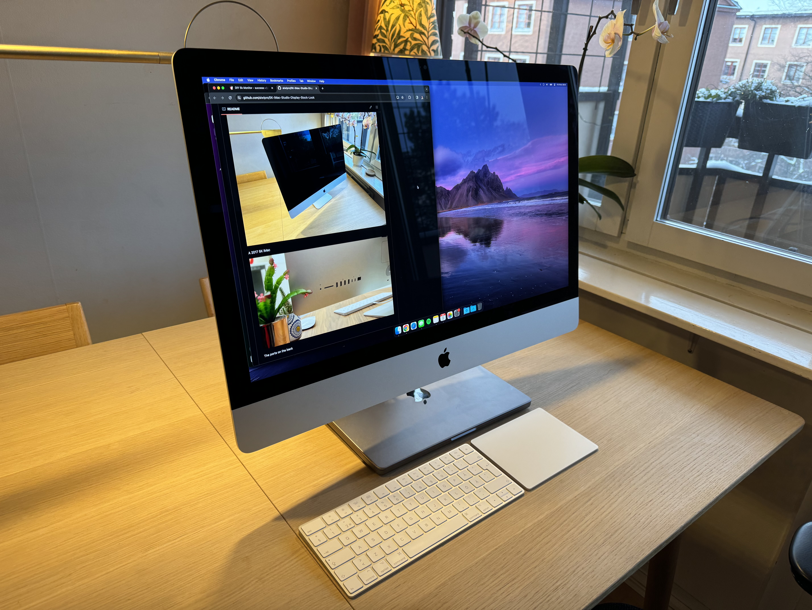
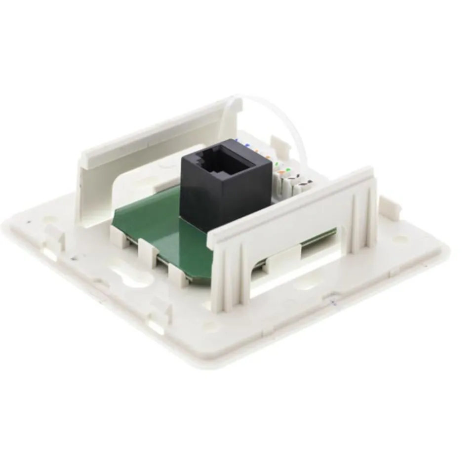
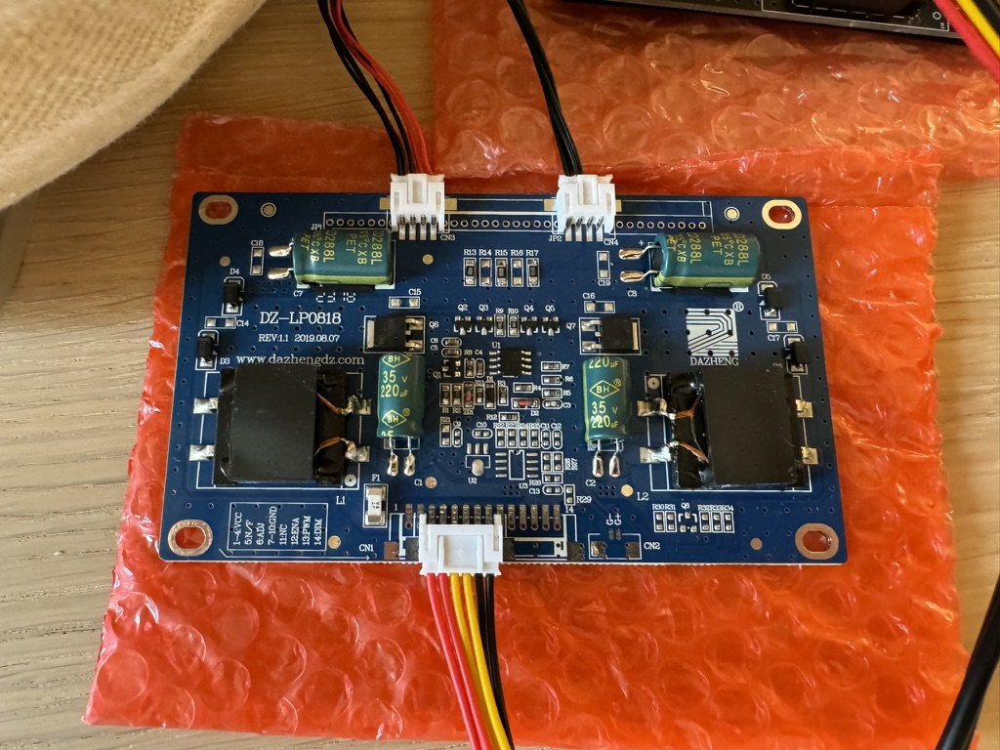
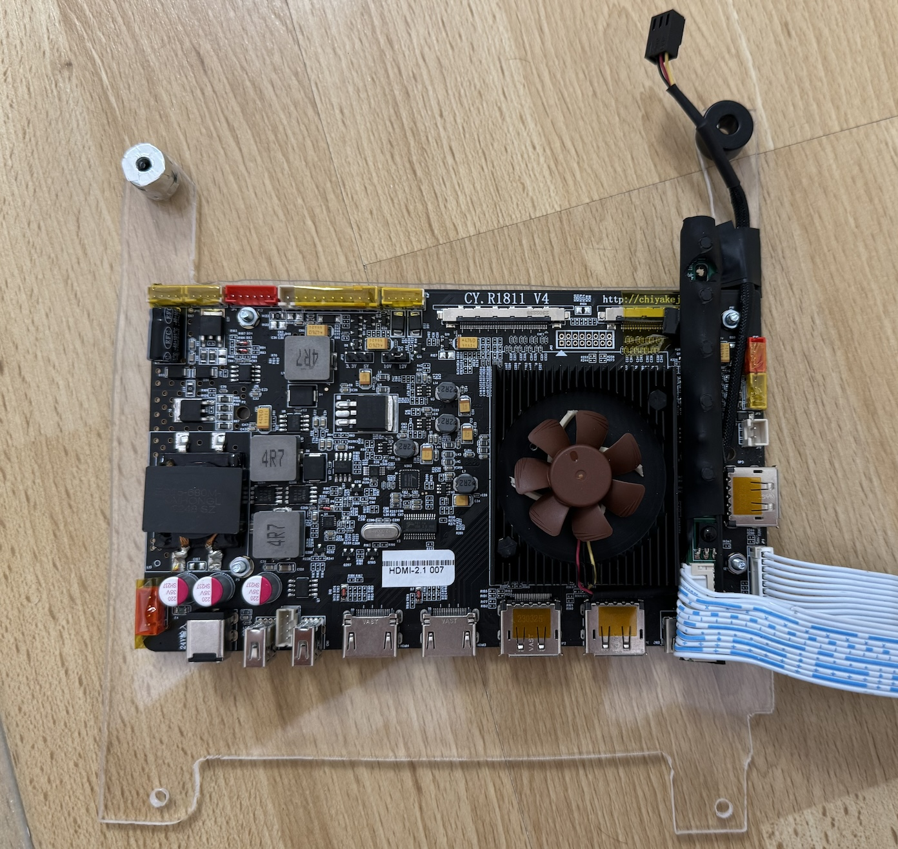
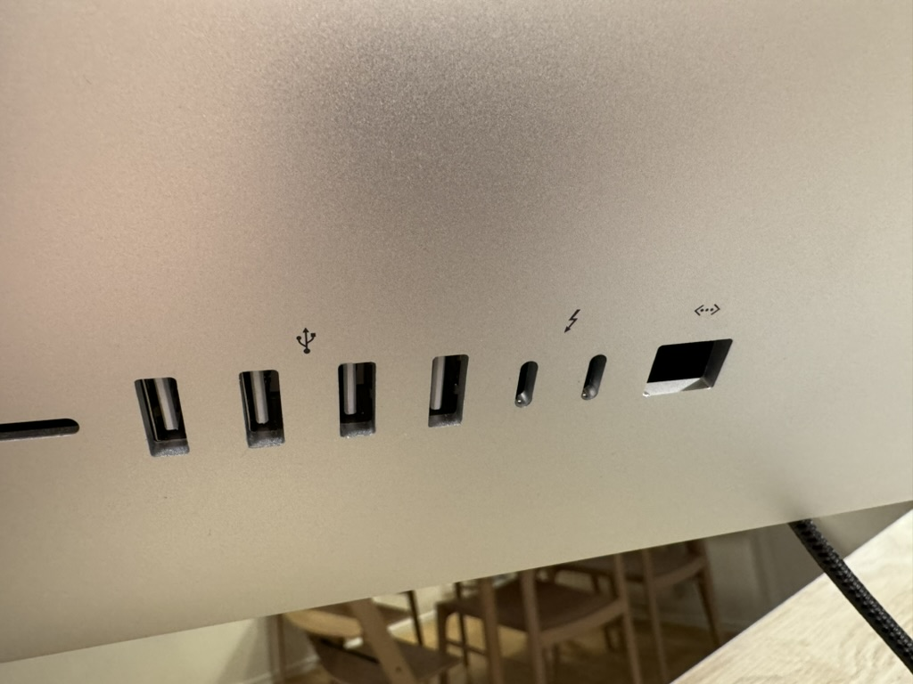
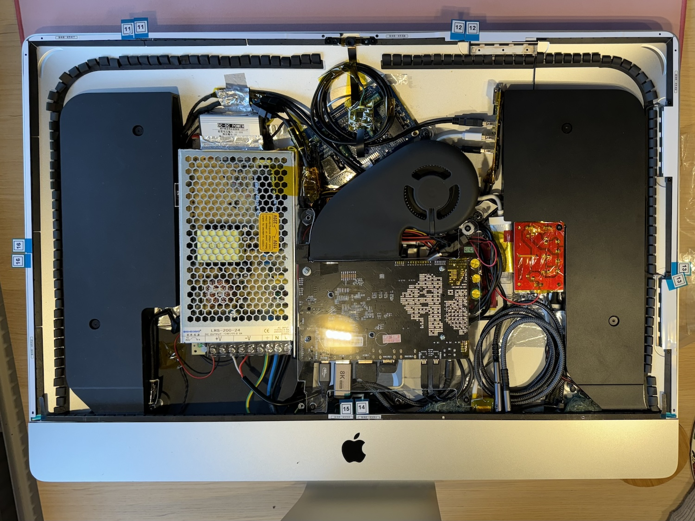
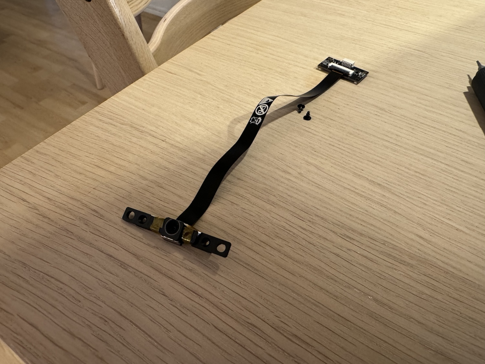
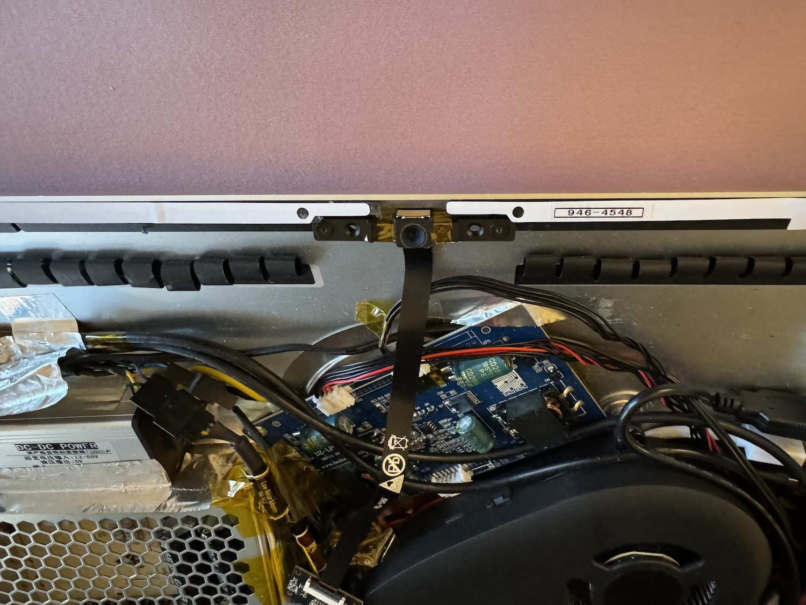

## 5K iMac Studio Display - Stock Look

Converting a 5K iMac to act as a generic 5K display is nothing new. What is yet to be found is a conversion that keeps the stock iMac look. This is what this project aims to achieve.

This won't be a comprehensive guide to building the DIY Studio Display with any panel type nor any display driver board. For that, please see [this excellent guide by Mykola](https://khronokernel.github.io/macos/2022/03/01/5K-MONITOR.html).

The stock look will be achieved using the Thunderbolt 3 ports as input for both USB-C and DisplayPort. The USB A ports and the Ethernet port will have full functionality. When using the USB-C input, all data transfer and charging of the source computer will be done using just one cable.

The FaceTime camera, microphones and speakers will all be integrated just like the original iMac.


## Before


A 2017 5K iMac


The ports on the back


## After 




The final result, currently connected to a 14" Macbook Pro.


The exterior keeps the stock look. The only way to spot the mod is that the Thunderbolt 3 ports and the Ethernet port are black. On the stock iMac, these are grey.


A single USB-C cable is needed to give your computer a:

- 5K Display
- 4K FaceTime Camera
- Microphone
- Speakers
- 90W Power Delivery

(In this picture, an Ethernet cable is also attached)


## The Starting iMac - a 2017 5K iMac


The starting point is a fully working 2017 5K iMac, which features:

* High-brightness 5K DCI-P3 display ```LM270QQ1 SDC1```
* Two Thunderbolt 3 ports
* Four USB 3 ports
* One Ethernet port
* One SD card slot
* One Headphone jack
* One AC input
* Built-in webcam
* Built-in microphone
* Built-in speakers


## The Plan


### R1811 V4 as Driver Board

The build will be based on the R1811 driver board. It supports the full 5120 x 2880 resolution at 10 bit color depth over a single cable. This works using its USB-C input (using DP-alt mode) as well as its regular DisplayPort (DP) inputs. Full color bit-depth requires a newer GPU on the source you plan to use, as it relies on the Display Stream Compression (DSC) technology. If we are talking Macbooks, anything with an M1 or newer will work just fine. There is a need to opt for a backlight boost board as well, as the 2017 iMac has tremendous max brightness.


### Thunderbolt/USB-C Ports

The plan is to run both the USB C and DP input through the original Thunderbolt 3 inputs. One input in each Thunderbolt port, using USB-C cables with a receptacle in one end and a header in the other - an USB-C extension cable, of sorts between the socket and the driver board. For DP, it’s crucial we buy bidirectional USB-C to DP cables. Far from every USB-C to DP cable is bidirectional.


### HDMI 2.1

I was able to buy the R1811 from the very factory that produces it, which means they were able to offer a new version with upgraded HDMI ports. HDMI 2.1 offers substantially higher bandwidth and many other useful features. It should be able to drive the full 5K resolution at 10 bit color. I thought of converting the driver board’s full size HDMI to mini or micro HDMI and placing a socket in the original ethernet jack. Finding a small enough adapter for micro or mini HDMI to full size HDMI was originally successful. But the specs were not accurate and it was not able to deliver the necessary bandwidth. Consequently, I will place the R1811 driver board in such a way that the HDMI ports are accessible through the RAM access door instead. That way any HDMI source can be connected with the RAM access door removed.


### USB Ports

Retaining the functionality of the USB A ports makes the entire iMac much more versatile as keyboard and various other peripherals can be attached with ease. As the R1811 has two USB 2.0 slots, we can use USB hubs to get enough ports to connect all internal features as well as the external ports. We will lose the USB 3 functionality of the original iMac. While not ideal, there is not a whole lot we can do about it other than using some sort of internal USB-C dock. USB-C docks that support DSC and other necessary features are not that well documented, so I will just accept that USB 2.0 is what we can get. To ensure all connected devices are able to be bus powered, we will boost the current available to the USB ports with an additional internal 5V power source.


### Ethernet

Like with the USB ports, an ethernet port can be surprisingly useful. The goal is to retain its function as well. I will use an internal USB network adapter. It will be limited to the USB 2.0 speed, 480Mb/sec. This is faster than WiFi in many situations and first and foremost, offers much higher stability. It’s important that the network card doesn’t need any driver installation for macOS or Windows.


### Webcam, Microphone and Speakers

An integral part of the iMac experience is the all-in-one sensation. We will install and integrate a slim 4K USB autofocus webcam. 

The original microphone in the 2017 iMac is a single digital MEMS microphone adhered to the inside of the aluminum frame holding the glass display panel. By having a clever gap in the adhesive and the black masking tape, the microphone is able to pick up sound despite being “buried” this deep in the iMac. It has a channel in which the audio is able to travel. The goal is to upgrade this same setup. I will use two analogue MEMS microphones and an USB sound card to achieve invisible audio pick up, just like the original iMac. 

The original speakers of the iMac will be powered by the same USB sound card as the microphones. It will be run straight from the headphone output of the USB sound card with two crossover filters distributing treble and bass to the correct speaker elements. It’s important that the sound card doesn’t need any driver installation for macOS nor Windows. The use of an USB sound card allows for easy volume adjustment from within macOS. MacOS does not natively allow volume adjustment of speakers routed through displayport.


### Monitor Settings

By opting to buy the IR remote controller bundle of the R1811 and placing the IR receiver in the rear thermal vent, invisible to the eye, we are able to control the monitor without any external modifications. I foresee only using this in the beginning to verify that all settings are correct.


### SD Card and Headphone Jack

These will not be converted as they are never used in our household. Ok, I do from time to time flash an SD card for a Raspberry Pi, but I might as well use the SD slot on my Macbook for this. The headphone jack is firmly glued in place and will be destroyed if removed.


### AC Power

The original power cable and power socket will be left unchanged. We will use a slim internal power supply with the capacity to provide enough power to power the display, all peripherals as well as offer 90-65W power delivery to any source connected via USB-C. According to the manufacturer for the R1811 board, we need at least 24V 7.5A (180W) for this. The build will use a 24V 8.8A (210W) power supply.


## Parts List

The majority of the parts were purchased while staying in China, as price and selection is much better than the international market. The listing links will most likely not work over time. So the listing name is offered as well. Nothing is wildly unique and can be found on various other sites as well. Some parts were purchased while back in Sweden. The total cost was just under 400 USD, excluding the cost of the original iMac.

| Picture | Part Name                                                       | Listing Name                                                                                                                                                                                          | Listing Link                                                                                                                                | Price (USD)      |
|-----------|--------------------------------------------------------------------|-------------------------------------------------------------------------------------------------------------------------------------------------------------------------------------------------------|--------------------------------------------------------------------------------------------------------------------------------------------|-------|
|          | R1811 V4 Display Driver Board                                      | R1811 5K液晶驱动板PS5HDMI2.1HDR EDP4K144Hz DP1.4Vbyone显示板 Variant: 驱动板（HDMI2.1)+按键板+屏线+电源+遥控器                                                                                        | [LINK](https://item.taobao.com/item.htm?id=575646153167)                                          | 245.7 |
|          | Backlight Booster Board for the R1811                              | DIY显示器配件 通用升压板 恒流板 高压板                                                                                                                                                                | [LINK](https://item.taobao.com/item.htm?id=581763490821)                                          | 7.7   |
|          | Analogue Bottom-Port MEMS Microphone (2pcs)                        | ADMP404 MEMS硅麦克风话筒咪头拾音模块 带前级放大芯片 Variant: 桔红色[S70版本]                                                                                                                          | [LINK](https://item.taobao.com/item.htm?id=639411803697)                                          | 4.2   |
|          | 4K (12MP) Webcam, 75° FOV with Autofocus                           | 4k1200万摄像头模组FPC排线imx258自动对焦模块usb免驱动工业相机 Variant: 透明[12MP 75度自动对焦]                                                                                                         | [LINK](https://item.taobao.com/item.htm?id=740521932923)                                          | 26.3  |
|          | USB Gigabit Ethernet Network Card                                  | usb转网口千兆网卡绿联 [交易快照] Variant: 15634☆【USB转百兆】白色-编织                                                                                                                                | [LINK](https://detail.tmall.com/item.htm?id=589827078853)                                         | 4.2   |
|          | Gigabit Ethernet Receptacle                                        | Utanpåliggande UTP-nätverksuttag Cat. 6 1-port                                                                                                                                                        | [LINK](https://www.kjell.com/se/produkter/kablar-kontakter/kablar-for-natverk/natverksuttag/utanpaliggande-utp-natverksuttag-cat.-6-1-port-p78180) | 10.2  |
|          | 40x10mm Noctua Fan                                                 | Noctua NF-A4x10 PWM                                                                                                                                                                                   | [LINK](https://www.inet.se/produkt/5320710/noctua-nf-a4x10-pwm#specifikationer)                                                                    | 16.8  |
|          | Noctua PWM Fan Controller                                         | Noctua NA-FC1                                                                                                                                                                                         | [LINK](https://www.inet.se/produkt/5320260/noctua-na-fc1-flaktkontroller)                                          | 26.5   |
|          | Fan resistor 1pcs (50 Ohm)                                         | Noctua NA-RC7                                                                                                                                                                                         | [LINK](https://www.amazon.se/Noctua-NA-SRC7-4-pin-Noise-Adapterkablar-PC-Fl%C3%A4ktar/dp/B00KG3KP1U?th=1)                                          | 9.2   |
|          | Crossover Filter (2 pcs)                                           | 可调试发烧HIFI喇叭音箱高低音二分频器 音响二路分频板 DIY配件 [交易快照] Variant: 散件                                                                                                                  | [LINK](https://item.taobao.com/item.htm?id=610340810586)                                          | 2.7   |
|          | 0.1uF Capacitor for MEMS Microphones (1pcs)                        | 直插铝电解电容0.1UF 0.22UF 0.33UF 0.47UF 50V 5*11MM ±20% Variant: 0.1UF 50V 5*11 50只                                                                                                                 | [LINK](https://detail.tmall.com/item.htm?id=608506196996)                                         | 0.2   |
|          | USB Sound Card for Microphones and Speakers                        | 绿联usb外置声卡台式机笔记本电脑接口专用外接独立音频转换器线转接头PS4音响耳机麦克风游戏直播免驱动便携 Variant: 胶壳款】USB外置声卡-磨砂黑                                                              | [LINK](https://detail.tmall.com/item.htm?id=564470736512)                                         | 5.0   |
|          | 200W Slim Power Supply (115x215x30mm)                              | lrs开关电源220转12v24v36v500w1000W大功率直流变压器2000W3000W Variant: 颜色分类：LRS-200-24[24V 8.8A] (You should go for the LRS-250-24[24V 10A] as it has the same outer diameters as the 8.8A model) | [LINK](https://item.taobao.com/item.htm?id=579576184224)                                          | 11.9  |
|          | Internal 4-port USB Hub                                            | 绿联USB扩展器插头多口集分线器接口转换3.0台式外接供电typec拓展坞hub延长线一拖四笔记本电脑平板手机usp Variant: 0.2m颜色分类：USB3.0接口【纹理款】USB3.0x4+Type-C供电口 (Buy a USB 2.0 hub instead)      | [LINK](https://detail.tmall.com/item.htm?id=633137075244)                                         | 4.9   |
|          | 4-port USB Hub for External Ports                                  | 【国庆价】usb扩展器充电分线器typec拓展坞插头接U盘键盘鼠标一分三多口hub笔记本电脑ubs1拖4转接头加长线 [交易快照] Variant: 0.5m颜色分类：USB 转 4个USB【一分 四 】充电+传输                              | [LINK](https://detail.tmall.com/item.htm?id=681226616184)                                         | 4.5   |
|          | USB Cable with Additional Power Source Input, 2-in-1-out (2pcs)    | 辅助供电USB延长线硬盘车载电脑 [交易快照] Variant: 0.3m颜色分类：USB2.0母转双USB公【2只装】                                                                                                            | [LINK](https://item.taobao.com/item.htm?id=705939221453)                                          | 1.4   |
|          | USB 4 Extension Cable (Header in one end, receptacle in the other) | ULT-unite Typec公对母延长线USB4全功能数据线转接适用于拓展坞switch笔记本数据延加长充电线雷电 Variant: 0.5米颜色分类：【直头】USB4延长线 40Gbps 8K/60Hz PD100W                                          | [LINK](https://detail.tmall.com/item.htm?id=684612055916)                                         | 6.7   |
|          | Bidirectional USB-C to DP Cable (2 pcs)                            | 海备思typec转dp1.4线8K高清转换线雷电4/3连接头2K165Hz高刷4K144Hz240Hz笔记 Variant: 【1米】8K60Hz/4K144Hz                                                                                               | [LINK](https://detail.tmall.com/item.htm?id=703374632981)                                         | 12.4  |
|          | USB 4 Double Receptacle                                            | 【国庆价】尚优琦USB4转接头TypeC公对母笔记本电脑40G高速雷电3/4数据线延长90度L形U型直角弯头PD快充 [交易快照] Variant: USB4◆转接头颜色分类：【直通母对母】必须搭配直通数据线才能使用                     | [LINK](https://detail.tmall.com/item.htm?id=674655541693)    | 1.0   |
|          | USB 4 90° Adapter (2pcs)                                           | 【国庆价】尚优琦USB4转接头TypeC公对母笔记本电脑40G高速雷电3/4数据线延长90度L形U型直角弯头PD快充 [交易快照] Variant: USB4◆转接头颜色分类：【直弯公对母】40Gbps/8K@120hz/PD100W                         | [LINK](https://detail.tmall.com/item.htm?id=674655541693)    | 3.1   |
|          | DC-DC converter 24V to 5V 6A                                       | 直流DC变压模块48V36V24V转12V2A3A5A10A15A车载降压器电源转换器 [交易快照] Variant: 8-58V转5V6A                                                                                                          | [LINK](https://item.taobao.com/item.htm?id=594940087910)                                          | 2.5   |
|          | Adhesive Strips for iMac 2017-2020                                 | imac拆机苹果电脑维修屏幕工具 [交易快照] Variant: 27海绵胶+拆屏(17-20年)                                                                                                                               | [LINK](https://item.taobao.com/item.htm?id=37749577080)                                           |       |


## Step 1. Initial Teardown


A mid 2017 5K iMac, 5120x2880 IPS-panel with 100% DCI-P3


The display panel is removed from the case


The high voltage AC connections will be in the same location as the original layout, as Apple has already placed good insulation in this location.

The main driver board should ideally be in the middle, as its ports could then be accessible through the RAM access door if needed.

The control board with buttons and the remote control IR receiver for is placed under the main driver board, facing out towards the fan grille. This enables the remote control to function through the rear fan grille.

A lot of room is kept clear in the lower right section, as cable management will be the biggest headache of this project.


## Step 2. Testing

The first step is to make sure everything works the way it should.


This was the only reference as to how to connect the backlight booster board. Fantastic.


It was enough. Here are some high resolution images for future reference.




Tests show that we have full 5K resolution at 10 bit color with Display Stream Compression (DSC) active for both USB-C and DisplayPort. The DSC ON message appears when changing input source, so it is not visible in the pictures below.


When trying HDMI I get full 5K resolution, but it says Reduced Bit Rate (RBR) and not full RGB but rather 422. My 2023 Macbook Pro does have HDMI 2.1 so it should work. 

I won’t dwell on this though, as I rarely use HDMI anyway. It could even be the cable I used not meeting the bandwidth requirements despite the cable manufacturer claiming so. Anyway, I will share some other cool features supported on the HDMI 2.1 board in the second image.


Power delivery is supported and works well at 90W when using USB-C.


There’s a need to confirm that all of the above tests remain passed while introducing the various 90° angle adapters and dongles. This mirrors the final build configuration.


## Step 3. Full Teardown

Everything seems to work just fine. Fantastic. The disassembly continues.


In a minute or two we are done.


The iMac is really neat. Just three major components. The PSU, Logic Board, and Fan. The Facetime camera too, I guess.


Let’s not forget to carefully remove the digital MEMS microphone.


## Step 4. Rough fitting

The main components are roughly placed:

* 24V PSU
* 24V to 5V DC-DC converter
* Driver board
* Backlight booster board


Pictured but later removed: 

* 24V to 12V DC-DC converter
* Speaker amplifier


Not pictured:

* USB network card
* USB sound card
* USB hub
* Crossover filters
* Data cables in general


## Step 5. Components and Modifications


The driver board is facing out towards the fan grille, and the original iMac fan returned. The driver board was placed on a new 3mm acrylic sheet, this time anchoring it in four places to the iMac case.




The 2017 iMac fan pin-out is very similar to a regular 4 pin PC fan pinout, except that pin 1 and pin 2 are swapped (12V and ground). By using a Noctua PWM fan controller (NA-FC1), we can power the iMac fan and the controller using the original 12V fan connector on the driver board.


The R1811 fan is rather loud, taking away from the magical iMac experience. Its noise is also picked up by the microphones. The stock fan is replaced with a silent Noctua 40x10mm fan together with the included NA-RC11 "100 Ohm Low Noise Adapter" and a NA-RC7 "50 Ohm Low Noise Adapter" in series. The microphones are padded with some sound insulation as well.


The USB hub is deconstructed and reconstructed to form a 4-port USB hub that matches the original external USB receptacle spacing and look.


By using aluminum tape and some spare plastic parts a hub that will snugly fit the iMac is created. 


Finding a set of white/gray usb receptacles is preferred as they match the original look.




Shortening the depth of the 90° USB 4 adapters allows the USB C cables to properly lock in place once the adapter is installed inside the iMac. A sacrificial USB-C cable is used to protect the innards of the adapter from accidental cuts when trimming.


The first adapter was cut by hand, and had its housing scuffed. The nicer looking one was trimmed using a Dremel.


A 3D printer would be fantastic for aligning and securing these components. Aluminum tape and various spare parts as spacing had to do the job in my case. The RJ45 ethernet receptacle is yet not trimmed to fit. Soldering the RJ45 receptacle to UTP cabling was unsuccessful in obtaining gigabit speeds, so a solderless solution was used.


Trimmed, connected and insulated RJ45 receptacle. Note that the front of the RJ45 receptacle was trimmed about 3mm in order for the latching mechanism to work correctly once installed inside the iMac.


For the speakers, a helpful user on the Macrumors provided the pinout: From top to bottom in this pic (with the contacts facing you):

1. Woofer +
2. Woofer -
3. ID link + connected to
4. ID link -
5. Tweeter +
6. Tweeter -


You can see 3 is looped back to 4 in this pic.


The microphone setup was designed by another user in their project “Coco-Mic”. You should probably use a non-polarized capacitor, as the diagram below actually shows. I used a polarized capacitor with the anode connected to the USB sound card microphone input. That worked for me.


Using thin VHB tape enables the mounting of the microphones in the correct spot.


One of the microphones was placed in the original location. It is incredibly hard to align it. I used a microscope for this. The other microphone was placed in one of the screw holes. To minimize the risk of high voltage AC issues and other electrical noise from the PSU, the microphones are placed on the right hand side of the iMac.


The internal USB hub is stripped of its housing and wrapped in Kapton tape.


The layout has the iMac fan at lowest speed, silently blowing air over the driver board. And yes, the non-horizontal backlight booster board is killing me inside.




The 4K autofocus webcam is secured on the monitor instead of the casing to reduce the tolerance chain and risk of misalignment.






On the topic of misalignment, the ports are very straight! Some of the misalignment in the picture is caused by the usb sticks themselves. Once we are happy with their location, we use two-component epoxy to lock it in place.


The USB ports are nice and stock-looking. The USB-C ports are black and grip any attached USB-C cables firmly, as they should. The ethernet jack is black too, also not gray. It does grip the cable well and works as it should though.


A single USB 4 cable is able to carry all data and power to the computer connected to it. The ethernet cable is incredibly nice in dense radio locations.


## Step 6. Final Layout and Assembly

Below is the fully assembled "Apple iMac Studio Display".


## Final Note

Using a USB-C cable from a Macbook works great on both inputs. Using an, allegedly bi-directional, USB-C to DP cable with an RTX3080 DP to USB-C (iMac Display) does not work on either input. I might purchase another USB-C DP cable to investigate further.

It’s totally possible to connect a regular DP cable with the RAM access door open. Both HDMI inputs are also very accessible and usable once the RAM access door is open.

Currently, the speakers are running from the headphone output of the USB sound card. This is not ideal. The plan is to introduce a ground loop isolator and try to use a powered amplifier.


## Sources

Main build guide - [Guide by Mykola](https://khronokernel.github.io/macos/2022/03/01/5K-MONITOR.html)

R1811 wiring - [Regulus67 on Macrumors](https://forums.macrumors.com/threads/diy-5k-monitor-success.2253100/page-29?post=32389594#post-32389594)

Speaker and iMac fan wiring - [PaulD-UK on Macrumors](https://forums.macrumors.com/threads/diy-5k-monitor-success.2253100/page-16?post=31844716#post-31844716)

Microphone wiring - [Coco-Mic](https://www.instructables.com/Coco-Mic-The-DIY-Studio-Quailty-USB-Mic-MEMS-techn/)
